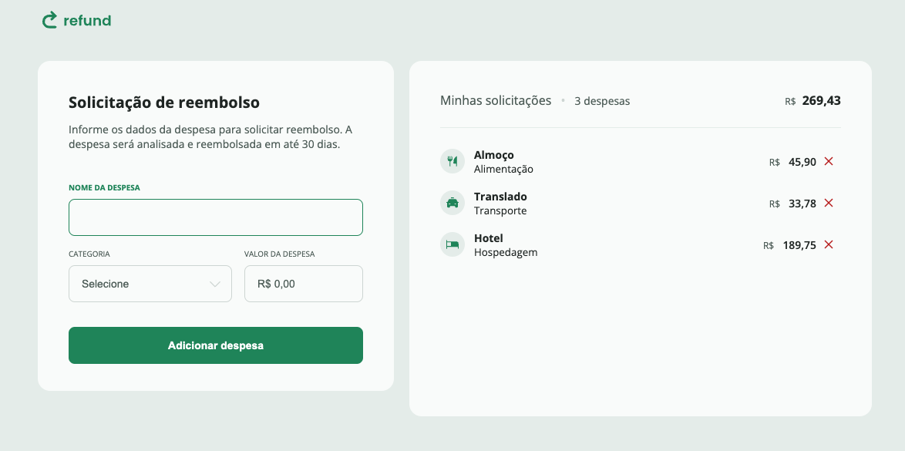

  

O projeto consiste em um site responsivo de sistema de reembolso, permitindo que os usuários gerenciem seus itens de forma prática, adicionando ou removendo-os conforme necessário.

  <a href="#-tecnologias">Tecnologias</a>&nbsp;&nbsp;&nbsp;|&nbsp;&nbsp;&nbsp;
  <a href="#-projeto">Projeto</a>&nbsp;&nbsp;&nbsp;|&nbsp;&nbsp;&nbsp;
  <a href="#memo-licença">Licença</a>

  

 

  

## 🚀 Tecnologias

Esse projeto foi desenvolvido com as seguintes tecnologias:

- HTML
- CSS
- Javascript

## Projeto

**Refund** é um projeto de site responsivo que oferece um sistema eficiente de reembolso, permitindo aos usuários gerenciar seus itens com facilidade. A plataforma possibilita adicionar e remover itens conforme necessário, priorizando simplicidade e funcionalidade. Com uma interface moderna e adaptável, o **Refund** foi projetado para atender às necessidades do usuário, tornando o processo de reembolso mais prático e organizado.
